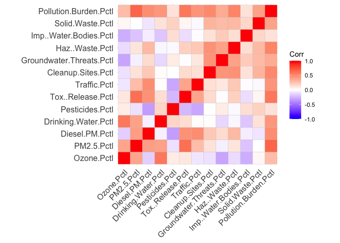
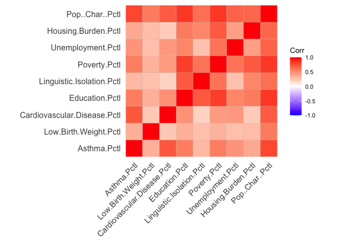
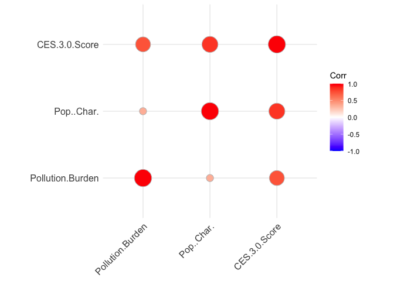
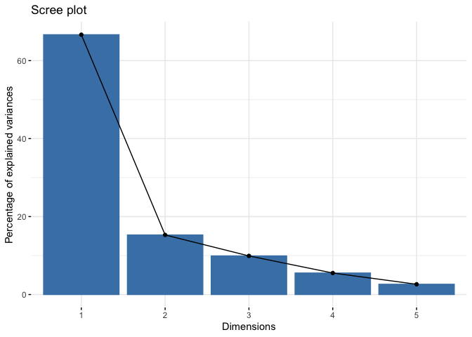
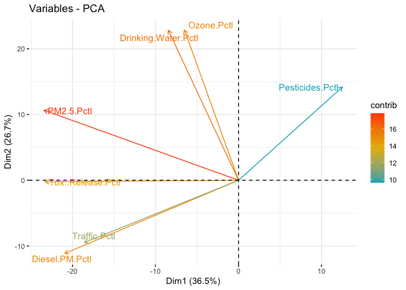
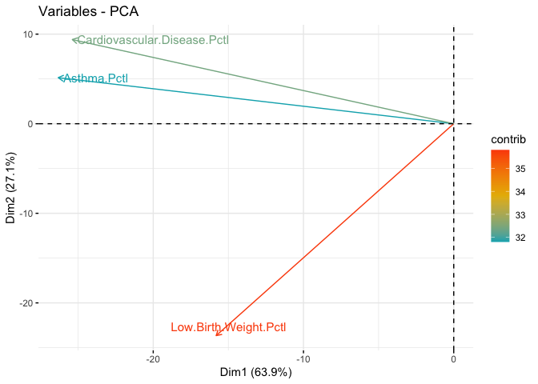
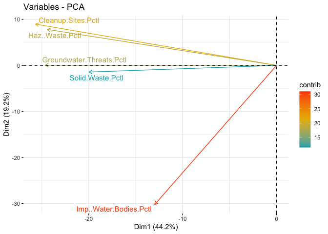
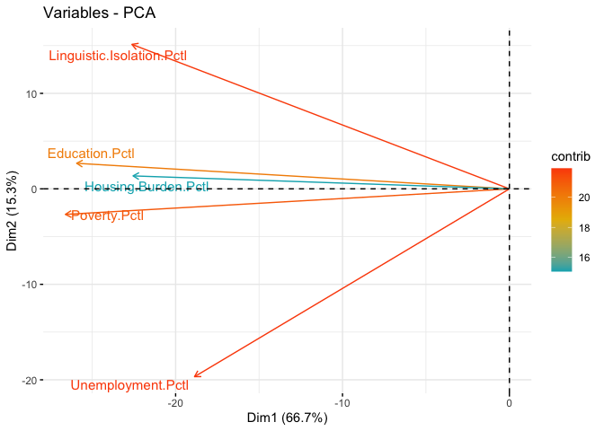

Environmental Equity Analysis
================
Akanksha Joshi

## Introduction

The dataset being used in this project is called the **CalEnviroScreen**
dataset. I truly believe that making data driven decisions is the best
way to drive real change in this world. Using data to understand the
impact on communities has always fascinated me and the CalEnviroScreen
dataset provides us the base information from which we can identify
California communities that are most affected by pollution, and where
people are often vulnerable to pollution’s effects. CalEnviroScreen uses
environmental, health, and socioeconomic information to produce scores
for every census tract in the state. The scores are mapped so that
different communities can be compared.The score measures the relative
pollution burdens and vulnerabilities in one census tract compared to
others and is not a measure of health risk.

## Data

#### Data Source

The dataset has been taken from CA Open data. It has been put together
by California Office of Environmental Health Hazard Assessment.

- The link to the dataset source is :
  <https://data.ca.gov/dataset/calenviroscreen-3-0-results/resource/89b3f4e9-0bf8-4690-8c6f-715a717f3fae>

- The link to the California Office of Environmental Health Hazard
  Assessment is : <https://oehha.ca.gov/about>

#### Data Collection

As per the official website the data is sourced from national and state
sources. The CalEnviroScreen indicators fall under 2 groups (4
sub-groups) :

##### **Pollution Indicators**

- **Exposure Indicators :** Contact with pollution
  - Air Quality:Ozone, Air Quality:PM2.5, Diesel Particulate Matter,
    Drinking Water, Pesticides, Toxic Release from facilities, Traffic
    Impacts
- **Environmental Effect Indicators :** Adverse environmental conditions
  caused by pollution
  - Cleanup Sites, Groundwater Threats, Hazardous Waste, Impaired Water
    Bodies, Solid Waste Sites

##### **Population Characteristics Indicators**

- **Sensitive Population Indicators :** Populations with biological
  traits that may magnify the effects of pollution exposures
  - Asthma, Low Birth Weight, Cardiovascular disease
- **Socioeconomic Factor Indicators :** Community characteristics that
  result in increased vulnerability to pollution
  - Education, Linguistic Isolation, Poverty, Unemployment,
    Housing.Burden

#### Cases

The data has been recorded at a Census tract level. Census tracts are
geographic units that are defined for the purpose of taking a census and
do not often change and are useful for combining, organizing, and
mapping data. CalEnviroScreen 3.0 uses census tract boundaries from the
2010 census. Boundaries often follow visible features or landmarks, such
as roads or rivers.

``` r
my_data <- read.csv(file = "~/Documents/Fall 2022/ISE - 201/Final Project/calenviroscreen-3.0-results-june-2018-update.csv")

sprintf("Dimentions of the main dataset are : %d rows X %d columns " , dim(my_data)[1] , dim(my_data)[2])
```

    ## [1] "Dimentions of the main dataset are : 8035 rows X 57 columns "

There are **8035 rows**. Each row of the dataset represents a census
tract.

#### Variables

There are **57 columns**. Each column represents a different variable.
The main variables I will be studying are those associated with the
pollution and population indicators, along with studying the
CalEnviroScreen Score for different communities.

- The following are the categorical variables :
  - Census Tract, California County, ZIP, Nearby City, Latitude,
    Longitude, SB 535 Disadvantaged Community
- The following are the numerical variables :
  - Total population, CES 3.0 Score, CES 3.0 Percentile, CES 3.0
    Percentile Range, Ozone, PM 2.5, Diesel, Drinking Water, Pesticides,
    Tox Release, Traffic, Cleanup Sites, Groundwater Threat, Hazardous
    Waste, Imp water bodies, Solid Waste, Pollution Burden, Asthma, Low
    Birth Weight, Cardiovascular Disease, Education, Linguistic
    Isolation, Poverty

#### Type of Study

The dataset was gathered to make an observational study and make data
available for use to the general public as well as help governments make
informed data driven decisions.

## Data Quality

For the variables associated with the pollution and population
indicators, we will only need the columns which gives us the percentile
scores for analysis, not the columns which give an absolute value. Thus,
we can drop them.

``` r
my_data = subset(my_data, select = -c(Ozone,PM2.5,Diesel.PM,Drinking.Water,Pesticides,
                                     Tox..Release,Traffic,Cleanup.Sites,Groundwater.Threats,
                                     Haz..Waste,Imp..Water.Bodies,Solid.Waste, Asthma,
                                     Low.Birth.Weight,Cardiovascular.Disease,Education,
                                     Linguistic.Isolation,Poverty,Unemployment,Housing.Burden
                                     ) )
sprintf("After dropping, the updated dataset dimensions are : %d rows and %d columns" , dim(my_data)[1], dim(my_data)[2])
```

    ## [1] "After dropping, the updated dataset dimensions are : 8035 rows and 37 columns"

20 columns containing pollution and population indicator values have
been dropped.

Finding total number of N/A values

``` r
sprintf("Total number of N/A values are : %d ",sum(is.na(my_data)))
```

    ## [1] "Total number of N/A values are : 1574 "

Finding total number of rows that contain N/A values

``` r
sprintf("Total number of rows that contain missing values are : %d ",sum(!complete.cases(my_data)))
```

    ## [1] "Total number of rows that contain missing values are : 478 "

We have a total of **1574** missing values in **478** rows. The column
names which have missing values are

``` r
names(which(colSums(is.na(my_data))>0))
```

    ##  [1] "CES.3.0.Score"             "CES.3.0.Percentile"       
    ##  [3] "PM2.5.Pctl"                "Drinking.Water.Pctl"      
    ##  [5] "Traffic.Pctl"              "Low.Birth.Weight.Pctl"    
    ##  [7] "Education.Pctl"            "Linguistic.Isolation.Pctl"
    ##  [9] "Poverty.Pctl"              "Unemployment.Pctl"        
    ## [11] "Housing.Burden.Pctl"       "Pop..Char."               
    ## [13] "Pop..Char..Score"          "Pop..Char..Pctl"

We will not drop any of the 478 rows (which have N/A values) as we will
loose a lot of other vital information present in that row. N/A values
are only present for pollution and population indicators (numeric
variables). We can’t drop them, however I can impute the missing values
with the mean of the column.

``` r
my_data2 <- my_data                                   
for(i in 1:ncol(my_data2)) {                                  
  my_data2[ , i][is.na(my_data2[ , i])] <- mean(my_data2[ , i], na.rm = TRUE)
}

sum_na = sum(is.na(my_data2))
sprintf("The number of rows with N/A values are : %d rows" ,sum_na) 
```

    ## [1] "The number of rows with N/A values are : 0 rows"

Thus, missing values have been imputed.

Checking for duplicate data

``` r
sum(duplicated(my_data2))
```

    ## [1] 0

There is no duplicate data; each row is a unique census tract. There are
no format issues with the given dataset.

## EDA and further Analysis

Few questions and explorations I can make from this dataset include the
following :

1.  What is the correlation between the 12 pollution burden and 8
    population characteristic variables?
2.  What is the relationship between population burden, population
    characteristic and CES score?
3.  Does the total population have any effect on the population burden,
    pollution characterisic and CES score?
4.  What features are most responsible for the detrimental effects on
    communities?
5.  Does the pollution burden and the population characteristic equally
    affect the CalEnviroScreen score?

##### 1. What is the correlation between different variables?

``` r
## Creating a dataframe that contains all the indicators as columns
my_data3 = subset(my_data2, select = c(Ozone.Pctl,PM2.5.Pctl,Diesel.PM.Pctl,Drinking.Water.Pctl,Pesticides.Pctl,
                                          Tox..Release.Pctl,Traffic.Pctl,Cleanup.Sites.Pctl,Groundwater.Threats.Pctl,
                                          Haz..Waste.Pctl,Imp..Water.Bodies.Pctl,Solid.Waste.Pctl,Pollution.Burden.Pctl,
                                          Asthma.Pctl,Low.Birth.Weight.Pctl,Cardiovascular.Disease.Pctl,Education.Pctl,
                                          Linguistic.Isolation.Pctl,Poverty.Pctl,Unemployment.Pctl,Housing.Burden.Pctl,
                                          Pop..Char..Pctl))
#my_data3
```

``` r
## Creating a dataframe that has Only pollution burden indicators
my_data4 = subset(my_data2, select = c(Ozone.Pctl,PM2.5.Pctl,Diesel.PM.Pctl,Drinking.Water.Pctl,Pesticides.Pctl,
                                          Tox..Release.Pctl,Traffic.Pctl,Cleanup.Sites.Pctl,Groundwater.Threats.Pctl,
                                          Haz..Waste.Pctl,Imp..Water.Bodies.Pctl,Solid.Waste.Pctl,Pollution.Burden.Pctl))
#my_data4
```

``` r
## Creating a dataframe that has Only population characteristic indicators
my_data5 = subset(my_data2, select = c(Asthma.Pctl,Low.Birth.Weight.Pctl,Cardiovascular.Disease.Pctl,Education.Pctl,
                                          Linguistic.Isolation.Pctl,Poverty.Pctl,Unemployment.Pctl,Housing.Burden.Pctl,
                                          Pop..Char..Pctl))
#my_data5
```

``` r
library(ggcorrplot)
cor_matrix_polbur = cor(my_data4,  use = 'complete')
#cor_matrix_polbur

ggcorrplot(cor_matrix_polbur)
```

<!-- -->

All pollution indicators are positively correlated to the pollution
burden variable. However, we can see there is negative correlation some
variables have with variables other than the pollution burden variable.

``` r
cor_matrix_popchar = cor(my_data5,  use = 'complete')
#cor_matrix_popchar

ggcorrplot(cor_matrix_popchar)
```

<!-- -->

All population character indicators are positively correlated to each
other.

##### 2. What is the relationship between population burden, population characteristic and CES score?

To understand the relation between the pollution burden, population
characteristic and CES score : We calculate the covariance matrix :

``` r
updated_df = subset(my_data2, select = c(Pollution.Burden,Pop..Char.,CES.3.0.Score) )
cov_matrix = cov(updated_df,  use = 'complete')
cov_matrix
```

    ##                  Pollution.Burden Pop..Char. CES.3.0.Score
    ## Pollution.Burden        163.36307   91.90351      152.8388
    ## Pop..Char.               91.90351  419.72822      280.7361
    ## CES.3.0.Score           152.83878  280.73611      258.0548

We calculate the correlation matrix :

``` r
cor_matrix = cor(updated_df,  use = 'complete')
cor_matrix
```

    ##                  Pollution.Burden Pop..Char. CES.3.0.Score
    ## Pollution.Burden        1.0000000  0.3509709     0.7443902
    ## Pop..Char.              0.3509709  1.0000000     0.8530181
    ## CES.3.0.Score           0.7443902  0.8530181     1.0000000

We can visualize the above in a plot :

``` r
library(ggcorrplot)
ggcorrplot(cor_matrix, method = "circle")
```

<!-- -->

The above correlation matrix calculation and visualization indicates
that both the pollution burden and the population characteristic are
positively correlated to the CES score. We also see that the population
characteristic has a slightly greater positive correlation to the CES
3.0 Score than the pollution burden.

##### 3. Does the total population have any effect on the population burden, pollution characteristic and CES score?

To further answer question2 and also answer question3 we group the
dataset as per the California Counties. Each row in the dataset
indicates one census track belonging to a particular county. There are
multiple census tracks belonging to the same county. Thus, it is
important for us to total the population for each track to get the
county total population. We also take the mean of the CES score and the
pollution burden and population characteristic at a county level. This
will help us analyze everything at a county level and help us draw
conclusions.

``` r
# Grouping the dataset by california county
library(dplyr)
df2 <- my_data2 %>% group_by(California.County) %>% 
  dplyr::summarize(Tot_Pop_County=sum(Total.Population),
            Avg_CES_County= mean(CES.3.0.Score),Avg_Pollution_Burden_County= mean(Pollution.Burden)) %>% as.data.frame()

#df2
```

``` r
# Libraries
library(ggplot2)
library(plotly)
library(viridis)
library(hrbrthemes)
library(webshot)

# Interactive version
p <- df2 %>%
  mutate(Avg_CES_County=round(Avg_CES_County,0)) %>%
  mutate(Tot_Pop_County=round(Tot_Pop_County/10,2)) %>%
  mutate(Avg_Pollution_Burden_County=round(Avg_Pollution_Burden_County,1)) %>%
  
  # Reordering counties to having big bubbles on top
  arrange(desc(Tot_Pop_County)) %>%
  mutate(California.County = factor(California.County)) %>%
  mutate(text = paste("County: ", California.County, "\nTot_Pop_County: ", Tot_Pop_County, "\nAvg_CES_County: ", Avg_CES_County, "\nAvg_Pollution_Burden_County: ", Avg_Pollution_Burden_County, sep="")) %>%
  
  # Classic ggplot
  ggplot( aes(x=Avg_CES_County, y=Avg_Pollution_Burden_County, size = Tot_Pop_County, color = California.County, text=text)) +
    geom_point(alpha=0.7) +
    scale_size(range = c(1.4, 19), name="Tot_Pop_County") +
    scale_color_viridis(discrete=TRUE, guide=FALSE) +
    theme_ipsum() +
    theme(legend.position="right")

# turning ggplot interactive with plotly
pp <- ggplotly(p, tooltip="text")
knitr::include_graphics("./Pol_CES_plot.png")
```


We can see in the above figure that as the pollution burden is
increasing, the mean CES score is also increasing. The size of the
bubble indicates the population of the County. Another observation we
can see is the trend that for counties with higher population, the CES
score and pollution burden tends to be higher. Some outliers to this
trend exist such as Contra Costa and Sonoma county which have a
population greater than 5 million but CES scores less than 20. The above
plot can be viewed in interactive mode in html R markdown. The above
plot loaded is a static image we get while hovering over the graph.

Performing a similar analysis for the **Population Characteristic** we
get the below plot.

``` r
df3 <- my_data2 %>% group_by(California.County) %>% 
  dplyr::summarise(Tot_Pop_County=sum(Total.Population),
            Avg_CES_County= mean(CES.3.0.Score),Avg_Population_Characteristic_County= mean(Pop..Char.),
            ) %>%
  as.data.frame()
```


We see a trend that as the population characteristics (asthma, poverty
etc) of the county increases, the CES score also increases. The size of
the bubble once again indicates the relative size of the total
population of the county. In addition we see that a higher total
population leads to a higher population characteristic and CES score.

#### 4. What features are most responsible for the detrimental effects on communities?

To understand which features have the most effect on the CalEnviroScore,
we need to do **PCA**. PCA is a dimensionality - reduction method that
reduces the number of variables of a data set, while preserving as much
information as possible.

``` r
exposure_data = subset(my_data2, select = c(Ozone.Pctl,PM2.5.Pctl,Diesel.PM.Pctl,Drinking.Water.Pctl,
                                         Pesticides.Pctl,Tox..Release.Pctl,Traffic.Pctl))
environmental_effect_data = subset(my_data2, select = c(Cleanup.Sites.Pctl,Groundwater.Threats.Pctl,
                                          Haz..Waste.Pctl,Imp..Water.Bodies.Pctl,Solid.Waste.Pctl))
sensitive_pop_data = subset(my_data2, select = c(Asthma.Pctl,Low.Birth.Weight.Pctl,Cardiovascular.Disease.Pctl))
socioeconomic_factor_data = subset(my_data2, select = c(Education.Pctl,Linguistic.Isolation.Pctl,Poverty.Pctl,
                                                        Unemployment.Pctl,Housing.Burden.Pctl))
```

``` r
exposure_data.pca <- prcomp(exposure_data)
summary(exposure_data.pca, scale=TRUE)
```

    ## Importance of components:
    ##                            PC1     PC2     PC3      PC4      PC5      PC6
    ## Standard deviation     46.3242 39.6596 26.0493 23.16636 19.90255 17.89459
    ## Proportion of Variance  0.3648  0.2674  0.1154  0.09124  0.06734  0.05444
    ## Cumulative Proportion   0.3648  0.6322  0.7476  0.83882  0.90616  0.96060
    ##                            PC7
    ## Standard deviation     15.2242
    ## Proportion of Variance  0.0394
    ## Cumulative Proportion   1.0000

``` r
str(exposure_data.pca)
```

    ## List of 5
    ##  $ sdev    : num [1:7] 46.3 39.7 26 23.2 19.9 ...
    ##  $ rotation: num [1:7, 1:7] -0.141 -0.506 -0.452 -0.182 0.27 ...
    ##   ..- attr(*, "dimnames")=List of 2
    ##   .. ..$ : chr [1:7] "Ozone.Pctl" "PM2.5.Pctl" "Diesel.PM.Pctl" "Drinking.Water.Pctl" ...
    ##   .. ..$ : chr [1:7] "PC1" "PC2" "PC3" "PC4" ...
    ##  $ center  : Named num [1:7] 53.3 53.6 50 50.3 18 ...
    ##   ..- attr(*, "names")= chr [1:7] "Ozone.Pctl" "PM2.5.Pctl" "Diesel.PM.Pctl" "Drinking.Water.Pctl" ...
    ##  $ scale   : logi FALSE
    ##  $ x       : num [1:8035, 1:7] -75.6 -68.6 -63.7 -32 -34 ...
    ##   ..- attr(*, "dimnames")=List of 2
    ##   .. ..$ : chr [1:8035] "1" "2" "3" "4" ...
    ##   .. ..$ : chr [1:7] "PC1" "PC2" "PC3" "PC4" ...
    ##  - attr(*, "class")= chr "prcomp"

For the exposure indicators,we can see that the first 3 Principal
Components (Ozone, PM2.5 and Diesel) can explain about 75% of the
variance.

``` r
environmental_effect.pca <- prcomp(environmental_effect_data)
summary(environmental_effect.pca, scale=TRUE)
```

    ## Importance of components:
    ##                            PC1     PC2     PC3     PC4     PC5
    ## Standard deviation     49.3013 32.5084 28.4618 25.4336 23.4985
    ## Proportion of Variance  0.4422  0.1923  0.1474  0.1177  0.1005
    ## Cumulative Proportion   0.4422  0.6345  0.7819  0.8995  1.0000

``` r
str(environmental_effect.pca)
```

    ## List of 5
    ##  $ sdev    : num [1:5] 49.3 32.5 28.5 25.4 23.5
    ##  $ rotation: num [1:5, 1:5] -0.521 -0.5 -0.495 -0.263 -0.405 ...
    ##   ..- attr(*, "dimnames")=List of 2
    ##   .. ..$ : chr [1:5] "Cleanup.Sites.Pctl" "Groundwater.Threats.Pctl" "Haz..Waste.Pctl" "Imp..Water.Bodies.Pctl" ...
    ##   .. ..$ : chr [1:5] "PC1" "PC2" "PC3" "PC4" ...
    ##  $ center  : Named num [1:5] 34.5 38 34.7 30.7 27.3
    ##   ..- attr(*, "names")= chr [1:5] "Cleanup.Sites.Pctl" "Groundwater.Threats.Pctl" "Haz..Waste.Pctl" "Imp..Water.Bodies.Pctl" ...
    ##  $ scale   : logi FALSE
    ##  $ x       : num [1:8035, 1:5] -104.4 -116.2 -65.1 -133.8 -113.2 ...
    ##   ..- attr(*, "dimnames")=List of 2
    ##   .. ..$ : chr [1:8035] "1" "2" "3" "4" ...
    ##   .. ..$ : chr [1:5] "PC1" "PC2" "PC3" "PC4" ...
    ##  - attr(*, "class")= chr "prcomp"

For the Environmental Effects indicators we see that the first 3
Principal Components (Cleanup.Sites,Groundwater.Threats,Haz..Waste.)
explain about 78% of the variability of the data.

``` r
sensitive_pop.pca <- prcomp(sensitive_pop_data)
summary(sensitive_pop.pca, scale=TRUE)
```

    ## Importance of components:
    ##                            PC1     PC2   PC3
    ## Standard deviation     39.8381 25.9658 14.95
    ## Proportion of Variance  0.6387  0.2713  0.09
    ## Cumulative Proportion   0.6387  0.9100  1.00

``` r
str(sensitive_pop.pca)
```

    ## List of 5
    ##  $ sdev    : num [1:3] 39.8 26 15
    ##  $ rotation: num [1:3, 1:3] -0.661 -0.397 -0.637 0.198 -0.911 ...
    ##   ..- attr(*, "dimnames")=List of 2
    ##   .. ..$ : chr [1:3] "Asthma.Pctl" "Low.Birth.Weight.Pctl" "Cardiovascular.Disease.Pctl"
    ##   .. ..$ : chr [1:3] "PC1" "PC2" "PC3"
    ##  $ center  : Named num [1:3] 49.9 50 50
    ##   ..- attr(*, "names")= chr [1:3] "Asthma.Pctl" "Low.Birth.Weight.Pctl" "Cardiovascular.Disease.Pctl"
    ##  $ scale   : logi FALSE
    ##  $ x       : num [1:8035, 1:3] -78.4 -56.5 -82.1 -74.2 -48.8 ...
    ##   ..- attr(*, "dimnames")=List of 2
    ##   .. ..$ : chr [1:8035] "1" "2" "3" "4" ...
    ##   .. ..$ : chr [1:3] "PC1" "PC2" "PC3"
    ##  - attr(*, "class")= chr "prcomp"

For the Sensitive Population indicators, the first PC alone explains 63%
and the first two combined explain 91% (Asthma, Low birth weight) of the
variance.

``` r
socioeconomic_factor.pca <- prcomp(socioeconomic_factor_data)
summary(socioeconomic_factor.pca, scale=TRUE)
```

    ## Importance of components:
    ##                            PC1     PC2      PC3      PC4      PC5
    ## Standard deviation     52.4984 25.1420 20.23948 15.10675 10.44363
    ## Proportion of Variance  0.6665  0.1529  0.09906  0.05519  0.02638
    ## Cumulative Proportion   0.6665  0.8194  0.91843  0.97362  1.00000

``` r
str(socioeconomic_factor.pca)
```

    ## List of 5
    ##  $ sdev    : num [1:5] 52.5 25.1 20.2 15.1 10.4
    ##  $ rotation: num [1:5, 1:5] -0.494 -0.431 -0.507 -0.359 -0.43 ...
    ##   ..- attr(*, "dimnames")=List of 2
    ##   .. ..$ : chr [1:5] "Education.Pctl" "Linguistic.Isolation.Pctl" "Poverty.Pctl" "Unemployment.Pctl" ...
    ##   .. ..$ : chr [1:5] "PC1" "PC2" "PC3" "PC4" ...
    ##  $ center  : Named num [1:5] 50.1 48.4 50.1 50.3 50.2
    ##   ..- attr(*, "names")= chr [1:5] "Education.Pctl" "Linguistic.Isolation.Pctl" "Poverty.Pctl" "Unemployment.Pctl" ...
    ##  $ scale   : logi FALSE
    ##  $ x       : num [1:8035, 1:5] -86.4 -92.2 -91.3 -69.8 -81.7 ...
    ##   ..- attr(*, "dimnames")=List of 2
    ##   .. ..$ : chr [1:8035] "1" "2" "3" "4" ...
    ##   .. ..$ : chr [1:5] "PC1" "PC2" "PC3" "PC4" ...
    ##  - attr(*, "class")= chr "prcomp"

For SocioEconomic Factor indicators, the first principal component alone
explains 66%, whereas first two (Education, Linguistic Isolation)
combined explain more than 81% of the variability.

``` r
library(factoextra)
fviz_eig(socioeconomic_factor.pca)
```

<!-- -->

Thus, from above PCA calculations, we can see that if we take just the
first two Principal Components for each Subcategory of indicators given,
we can explain on average about 75% of the variability of the data. We
can therefore, reduce the number of variables needed to estimate the
calenviroscore.

#### 5. Does the pollution burden and the population characteristic equally affect the CalEnviroScreen score?

To understand the effect on CalEnviroScreen score we run a hypothesis
test to check if the weightage given to CES score should be equal for
these two indicators.

Null hypothesis : Ho : The mean Population Characteristic component is
equal to the mean Pollution Burden

Alternate hypothesis : HA : The mean Population Characteristic component
is not equal to the mean Pollution Burden

Test statistic : Calculating the mean of population characteristic and
pollution burden

Reference distribution : t-distribution

``` r
t.test(x = my_data$Pollution.Burden, y = my_data$Pop..Char.,alternative="two.sided", conf.level=0.95)
```

    ## 
    ##  Welch Two Sample t-test
    ## 
    ## data:  my_data$Pollution.Burden and my_data$Pop..Char.
    ## t = -29.145, df = 13205, p-value < 2.2e-16
    ## alternative hypothesis: true difference in means is not equal to 0
    ## 95 percent confidence interval:
    ##  -8.460112 -7.393859
    ## sample estimates:
    ## mean of x mean of y 
    ##  41.96536  49.89235

As the p-value is less than 0.05, we **reject** the null hypothesis and
accept the alternative hypothesis. This means that a significant
difference does exist and the mean between the two components is not
equal. Furthermore, this gives us an idea that the effect these two
components have on the final CES score may not be exactly equal, with
population characteristic having a slightly higher effect.

## Conclusion

We have tried to analyze the huge dataset of CalEnviroScreen. In
summary, we saw the various correlations that exist between the
pollution burden and population characteristic indicators. We saw the
effect of the total population on these indicators, wherein we saw a
trend of increased CES score for bigger populations.This can help
governments allocate relatively larger budgets to tackle the effects of
pollution and pop characteristics for bigger population counties. With
the help of PCA we were able to determine the important features that
most affect the CES score. We can reduce the number of features if we
want to do further ML modeling.Another way of looking at this, is that
we now know the two indicators in each subcategory that the government
or any agency should concentrate on to improve the overall living
conditions of a county. Just concentrating and improving on 2 of the
factors may result in major benefits and positive changes in society.
Our hypothesis testing helped us understand that the pollution burden
and population characteristic do not have an equal effect on the CES
score. Thus, further analysis or adjustments can be made in future
CalEnviroScreen dataset creation by The California Office of
Environmental Health Hazard Assessment.

## Limitations and Future Work

As this dataset had certain missing values in numeric variables, we had
to impute using the mean. Thus, we do not know if this imputation has
had any negative effect on the findings of the project. Another
limitation of this dataset is that it does that have any demographic
information, thus we cannot draw any conclusions related to that. Within
a particular county we cannot understand if one demographic is
disproportionately effected over another. In the future, we can try and
improve the imputation methodology used in the project. We can also make
adjustments to the weightage calculation to the CES score for the
pollution burden and population characteristic.

## References

The California Office of Environmental Health Hazard Assessment has
gathered the data and generated a report :
<https://oehha.ca.gov/media/downloads/calenviroscreen/report/ces3report.pdf>

They have mainly covered an in-depth analysis on the individual
indicators and calculated the CalEnviroScreen score.

For PCA visualization -
<http://www.sthda.com/english/articles/31-principal-component-methods-in-r-practical-guide/118-principal-component-analysis-in-r-prcomp-vs-princomp/>

## Appendix

Summary statistics of the dataset

``` r
summary(my_data)
```

    ##   Census.Tract       Total.Population California.County       ZIP       
    ##  Min.   :6.001e+09   Min.   :    0    Length:8035        Min.   :   32  
    ##  1st Qu.:6.037e+09   1st Qu.: 3358    Class :character   1st Qu.:91602  
    ##  Median :6.059e+09   Median : 4413    Mode  :character   Median :92691  
    ##  Mean   :6.055e+09   Mean   : 4636                       Mean   :92837  
    ##  3rd Qu.:6.073e+09   3rd Qu.: 5656                       3rd Qu.:94558  
    ##  Max.   :6.115e+09   Max.   :37452                       Max.   :96161  
    ##                                                                         
    ##  Nearby.City...to.help.approximate.location.only.   Longitude     
    ##  Length:8035                                      Min.   :-124.3  
    ##  Class :character                                 1st Qu.:-121.5  
    ##  Mode  :character                                 Median :-118.4  
    ##                                                   Mean   :-119.4  
    ##                                                   3rd Qu.:-117.9  
    ##                                                   Max.   :-114.3  
    ##                                                                   
    ##     Latitude     CES.3.0.Score   CES.3.0.Percentile CES.3.0..Percentile.Range
    ##  Min.   :32.55   Min.   : 0.98   Min.   :  0.01     Length:8035              
    ##  1st Qu.:33.92   1st Qu.:14.96   1st Qu.: 25.01     Class :character         
    ##  Median :34.21   Median :25.06   Median : 50.01     Mode  :character         
    ##  Mean   :35.50   Mean   :27.93   Mean   : 50.01                              
    ##  3rd Qu.:37.63   3rd Qu.:39.35   3rd Qu.: 75.00                              
    ##  Max.   :41.95   Max.   :94.09   Max.   :100.00                              
    ##                  NA's   :106     NA's   :106                                 
    ##  SB.535.Disadvantaged.Community   Ozone.Pctl       PM2.5.Pctl    
    ##  Length:8035                    Min.   :  0.24   Min.   :  0.01  
    ##  Class :character               1st Qu.: 25.87   1st Qu.: 30.70  
    ##  Mode  :character               Median : 53.02   Median : 52.61  
    ##                                 Mean   : 53.30   Mean   : 53.59  
    ##                                 3rd Qu.: 77.87   3rd Qu.: 81.66  
    ##                                 Max.   :100.00   Max.   :100.00  
    ##                                                  NA's   :19      
    ##  Diesel.PM.Pctl   Drinking.Water.Pctl Pesticides.Pctl  Tox..Release.Pctl
    ##  Min.   :  0.01   Min.   :  0.01      Min.   :  0.00   Min.   :  0.00   
    ##  1st Qu.: 25.01   1st Qu.: 25.01      1st Qu.:  0.00   1st Qu.: 24.85   
    ##  Median : 50.01   Median : 51.02      Median :  0.00   Median : 49.90   
    ##  Mean   : 50.02   Mean   : 50.34      Mean   : 17.98   Mean   : 49.90   
    ##  3rd Qu.: 75.00   3rd Qu.: 78.57      3rd Qu.: 30.45   3rd Qu.: 74.95   
    ##  Max.   :100.00   Max.   :100.00      Max.   :100.00   Max.   :100.00   
    ##                   NA's   :18                                            
    ##   Traffic.Pctl    Cleanup.Sites.Pctl Groundwater.Threats.Pctl Haz..Waste.Pctl 
    ##  Min.   :  0.01   Min.   :  0.00     Min.   :  0.00           Min.   :  0.00  
    ##  1st Qu.: 25.01   1st Qu.:  0.00     1st Qu.:  0.33           1st Qu.:  0.00  
    ##  Median : 50.01   Median : 27.29     Median : 33.60           Median : 25.76  
    ##  Mean   : 50.01   Mean   : 34.45     Mean   : 38.02           Mean   : 34.71  
    ##  3rd Qu.: 75.00   3rd Qu.: 63.41     3rd Qu.: 66.78           3rd Qu.: 63.00  
    ##  Max.   :100.00   Max.   :100.00     Max.   :100.00           Max.   :100.00  
    ##  NA's   :56                                                                   
    ##  Imp..Water.Bodies.Pctl Solid.Waste.Pctl Pollution.Burden
    ##  Min.   :  0.00         Min.   :  0.00   Min.   : 8.37   
    ##  1st Qu.:  0.00         1st Qu.:  0.00   1st Qu.:32.24   
    ##  Median : 15.26         Median :  9.08   Median :41.80   
    ##  Mean   : 30.68         Mean   : 27.33   Mean   :41.97   
    ##  3rd Qu.: 63.17         3rd Qu.: 52.84   3rd Qu.:51.02   
    ##  Max.   :100.00         Max.   :100.00   Max.   :81.19   
    ##                                                          
    ##  Pollution.Burden.Score Pollution.Burden.Pctl  Asthma.Pctl    
    ##  Min.   : 1.030         Min.   :  0.01        Min.   :  0.00  
    ##  1st Qu.: 3.970         1st Qu.: 25.01        1st Qu.: 24.88  
    ##  Median : 5.150         Median : 50.01        Median : 49.93  
    ##  Mean   : 5.169         Mean   : 50.01        Mean   : 49.93  
    ##  3rd Qu.: 6.280         3rd Qu.: 75.00        3rd Qu.: 74.96  
    ##  Max.   :10.000         Max.   :100.00        Max.   :100.00  
    ##                                                               
    ##  Low.Birth.Weight.Pctl Cardiovascular.Disease.Pctl Education.Pctl  
    ##  Min.   :  0.00        Min.   :  0.00              Min.   :  0.00  
    ##  1st Qu.: 24.98        1st Qu.: 25.00              1st Qu.: 25.08  
    ##  Median : 50.22        Median : 49.96              Median : 50.00  
    ##  Mean   : 50.04        Mean   : 49.98              Mean   : 50.05  
    ##  3rd Qu.: 75.06        3rd Qu.: 75.07              3rd Qu.: 74.99  
    ##  Max.   :100.00        Max.   :100.00              Max.   :100.00  
    ##  NA's   :222                                       NA's   :96      
    ##  Linguistic.Isolation.Pctl  Poverty.Pctl    Unemployment.Pctl
    ##  Min.   :  0.00            Min.   :  0.00   Min.   :  0.00   
    ##  1st Qu.: 22.52            1st Qu.: 25.10   1st Qu.: 25.46   
    ##  Median : 48.34            Median : 50.11   Median : 50.27   
    ##  Mean   : 48.36            Mean   : 50.07   Mean   : 50.32   
    ##  3rd Qu.: 74.23            3rd Qu.: 75.02   3rd Qu.: 75.52   
    ##  Max.   :100.00            Max.   :100.00   Max.   :100.00   
    ##  NA's   :242               NA's   :79       NA's   :155      
    ##  Housing.Burden.Pctl   Pop..Char.    Pop..Char..Score Pop..Char..Pctl 
    ##  Min.   :  0.03      Min.   : 2.53   Min.   : 0.260   Min.   :  0.01  
    ##  1st Qu.: 25.51      1st Qu.:33.76   1st Qu.: 3.500   1st Qu.: 25.01  
    ##  Median : 50.33      Median :49.96   Median : 5.180   Median : 50.01  
    ##  Mean   : 50.18      Mean   :49.89   Mean   : 5.174   Mean   : 50.01  
    ##  3rd Qu.: 75.01      3rd Qu.:66.45   3rd Qu.: 6.890   3rd Qu.: 75.00  
    ##  Max.   :100.00      Max.   :96.43   Max.   :10.000   Max.   :100.00  
    ##  NA's   :157         NA's   :106     NA's   :106      NA's   :106

Visualizations for PCA

``` r
fviz_pca_var(exposure_data.pca,
             col.var = "contrib", # Color by contributions to the PC
             gradient.cols = c("#00AFBB", "#E7B800", "#FC4E07"),
             repel = TRUE     # Avoid text overlapping
             )
```

<!-- -->

``` r
fviz_pca_var(sensitive_pop.pca,
             col.var = "contrib", # Color by contributions to the PC
             gradient.cols = c("#00AFBB", "#E7B800", "#FC4E07"),
             repel = TRUE     # Avoid text overlapping
             )
```

<!-- -->

``` r
fviz_pca_var(environmental_effect.pca,
             col.var = "contrib", # Color by contributions to the PC
             gradient.cols = c("#00AFBB", "#E7B800", "#FC4E07"),
             repel = TRUE     # Avoid text overlapping
             )
```

<!-- -->

``` r
fviz_pca_var(socioeconomic_factor.pca,
             col.var = "contrib", # Color by contributions to the PC
             gradient.cols = c("#00AFBB", "#E7B800", "#FC4E07"),
             repel = TRUE     # Avoid text overlapping
             )
```

<!-- -->
